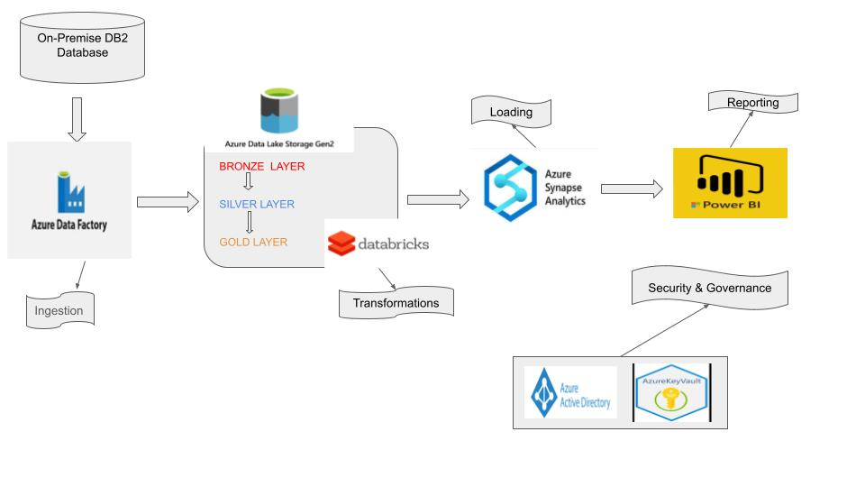

#Logistics Data Engineering Pipeline using Azure Data Factory-ADLS-Gen-2-Databricks-Synapse Analytics with Power BI
## Introduction
This project leverages Azure Data Factory to orchestrate logistics data pipelines and Azure Databricks with PySpark for efficient data processing. Azure Data Lake Gen 2 is used for scalable and secure data storage, while Azure Synapse Analytics supports complex data analytics. Power BI provides actionable insights through dynamic visualizations.
## Architecture

## Technology Used
1. Programming Language - Python
2. Scripting Language - SQL
3. Azure Cloud Platform
   - Azure Data Factory
   - Azure Databricks
   - Azure Data Lake Gen 2
   - Azure Synapse Analytics
   - Azure Data Studio
   
